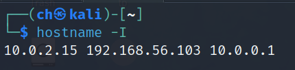

# Security GL4

Type: Cryptography, SECURITY
Status: Open, Resurface

<aside>
💡

</aside>

## Action Items

- [x]  PKI
- [x]  Openssl (SSL/TLS)
- [x]  OpenVPN
- [x]  Feistel
- [x]  EC
- [x]  Kerberos
- [x]  SQLI et XSS

## Notes

---

## General commands

```bash
#Affichage des keys 
gpg --list-keys
#Exportation des cles
gpg -o FileName --export [PublicKey]
#ifconfig to check my address
ifconfig
#Envoie de cle
scp FileName machineName@ip:/path 
#importation du cle 
gpg --import [PublicKey]
#signer la cle
gpg --edit-key [PublicKey]
	gpg-> sign (or naajmou naamlou Trust taatik trust ultimate)
-> cad je suis le garant de A je connait A
#gpg fingerprint : Info about the key author ....
gpg --fingerprint [PublicKey] 
# Outil sig2dot2  (creating PGP signing web-of-trust-graphics
(Install dependacies & clone project before)
gpg --no-options --with-colons --fixed-list-mode --list-sigs | ./sig2dot2/sig2dot.py > test.dot
dot -Tpng test.dot -o test.png (voir Figure 1)

```

## **Graphe de confiance en utilisant gpg**


Figure 1

## Key Management

1. `gpg --list-keys`: Lists all GPG keys in the keyring.
2. `gpg --export -o [FileName] [PublicKey]`: Exports a public key to a file.
3. `gpg --import [PublicKey]`: Imports a public key into your keyring.

## Key Trust and Signing

1. `gpg --edit-key [PublicKey]`: Enters the key editing mode to sign or trust a key.
    - Inside the editor, `sign` command is used to sign the key.
    - `trust` command is used to set the trust level of the key.
2. `gpg --fingerprint [PublicKey]`: Shows the fingerprint and additional information about the key.

## Creating Trust Graph

1. `gpg --list-sigs | ./sig2dot2/sig2dot.py > test.dot`: Converts the GPG signing information into a .dot file.
2. `dot -Tpng test.dot -o test.png`: Converts the .dot file into a PNG image, showing the web of trust.


Figure 1

## Certificate Information

1. `openssl s_client -connect [host]:[port]`: Connects to a server and displays the SSL certificate.
2. `openssl x509 -in [certFile] -subject -noout`: Displays the subject line of a certificate.

## Base64 Encoding and Decoding

1. `openssl enc -base64 -in [fileName]`: Encodes a file in Base64 format.
2. `echo "[base64-code]" | openssl base64 -d`: Decodes a Base64 encoded string.

## Symmetric Encryption and Decryption

1. `openssl enc -AES-256-CBC -in [fileName] -out [outputFileName]`: Encrypts a file using AES-256-CBC.
    - `a` for ASCII output.
    - `p` to show salt, key, and IV.
2. `openssl enc -AES-256-CBC -d -in [fileName]`: Decrypts an AES-256-CBC encrypted file.
    1. `openssl enc -AES-256-CBC -in [fileName] -out [outputFileName]`: Encrypts a file using AES-256-CBC.
        - `a` for ASCII output.
        - `p` to show salt, key, and IV.
    2. `openssl enc -AES-256-CBC -d -in [fileName]`: Decrypts an AES-256-CBC encrypted file.

## Hashing

1. `openssl dgst -sha256 [file] > [hashFile]`: Creates a SHA256 hash of a file.


Different digests but both refer to word “Bonjour”

## File Encryption and Decryption

1. `openssl enc -aes-256-cbc -in [file]`: Encrypts a file using AES-256-CBC encryption.
2. `openssl enc -aes-256-cbc -in [file] -iter [n]`: Specifies iteration count `n` for encryption.
3. `openssl enc -aes-256-cbc -in [file] -iter [n] -p`: Encrypts with password iteration and displays the salt, key, and IV.
4. `openssl passwd -6 [options] [password]` : 
    - Explication :
        - `openssl passwd -6 [options] [password]`
            - **Description**: Generates a SHA-512 hashed password. Using `6` specifies the SHA-512 hashing algorithm. The command can be used in interactive mode (without providing a password) or by directly supplying a password as an argument.
            - **Options**:
                - `salt [salt_string]`: Optionally specify a salt string.
                - `table`: Output in table format.
                - `stdin`: Read password from standard input.
                - **Example**:
                    - **Interactive Mode**:
                        - Command: `openssl passwd -6`
                        - The system will prompt for the password, and upon entry, it will display the SHA-512 hashed password.
                    - **Direct Mode**:
                        - Command: `openssl passwd -6 -salt xyz mypassword`
                        - This will output the SHA-512 hash of "mypassword" using "xyz" as the salt.
                            - **Hash String**: **`$6$bP/cdm6T8xks5Zza$dEEObQint6hPnXDO8etRyv7OPo0w1TZ9kM00vSt9qhnVScIgy9mKAgafKce1KL1HuduhrWXRLK.bE2tCLHVI51`**
                                - **Description**: This is a hashed password string using the SHA-512 hashing algorithm, commonly found in Unix and Linux systems. The hash string is divided into several parts, each serving a specific purpose.
                                - **Format**: **`$[algorithm]$[salt]$[hashedpassword]`**
5. `fallocate -l 30M largeFile` : allocate size for a file
6. `openssl smime -encyrpt -aes256 -in LargeFile -binary -outform PEM -out LargeFile.enc cert` : encrypts the file **`LargeFile`** using AES-256 encryption with S/MIME, outputs it in PEM format to **`LargeFile.enc`**, using the recipient's public certificate **`cert`**.
    1. We can use smime for symmetric-asymmetric encryption

## RSA Key Generation and Management

1. `openssl genrsa -out [filename] 2048`: Generates an RSA private key of 2048 bits.
2. `openssl rsa -in [keyfile] -aes-256-cbc -out [encrypted_keyfile]`: Encrypts an RSA key file with AES-256-CBC.
3. `openssl genrsa -des3 -out [encrypted_keyfile] 512` : Creates An encyrpted Rsa key file with des3
4. `openssl rsa -in [private_key_file] -pubout -out [public_key_file]`: Extracts the public key from a private key.
5. `openssl rsa -in [encrypted_keyfile] -pubout -out [public_key_file]`: Extracts the public key from an encrypted private key.
    1. It will ask for the password

## RSA Encryption and Decryption

1. `openssl rsautl -encrypt -in [file] -pubin [public_key_file]`: Encrypts a file using RSA public key.
    1. Note: Deprecated method
2. `openssl pkeyutl -encrypt -pubin -inkey clePublicFromClef -in test -out test.enc` : Encrypts a file using RSA public key.
3. `openssl pkeyutl -encrypt -in [file] -pubin [public_key_file] -inkey [keyfile]`: Encrypts a file using a specified key and public key.
4. `openssl pkeyutl -decrypt -inkey [private_key_file] -in [encrypted_file] -out [output_file]`: Decrypts a file using RSA private key.

## Signing and Verifying

1. `openssl dgst -sha256 -sign [private_key_file] -out [signature_file] [input_file]`: Signs a file using SHA256 and a private key.
2. `openssl dgst -sha256 -verify [public_key_file] -signature [signature_file] [input_file]`: Verifies a signature using SHA256 and a public key.
- Explication & example
    
    ### **Signing Files: A Simple Explanation**
    
    Think of a digital signature as an electronic version of a physical signature or a stamped seal, but much more secure. When you sign a physical document, your signature serves two main purposes:
    
    1. **Authenticity**: It proves that the document comes from you.
    2. **Integrity**: It assures the receiver that the document hasn't been changed since you signed it.
    
    A digital signature does the same for digital documents or files.
    
    ### **How It Works**
    
    - **Creating a Signature**: You use a special software (like OpenSSL) and a secret code (known as your private key) to create a digital signature based on the contents of your file.
    - **Attaching the Signature**: This digital signature is then attached to the file or sent along with it.
    
    ### **The Verification Process**
    
    When someone receives your signed file, they can:
    
    - **Verify Authenticity**: Check if the signature was really made by you (they do this using your public key, which is like the public version of your secret code).
    - **Check Integrity**: See if the file has been altered after you signed it. If anyone changes even a tiny bit of the file, the signature won't match anymore.
    
    ### **Example**
    
    Let's take a simple example:
    
    - **Alice** writes a letter in a digital format (say, a Word document) and signs it using her private key, creating a digital signature.
    - She sends this letter and the digital signature to **Bob**.
    - Bob, upon receiving the letter and the signature, uses Alice's public key (which he already has or gets from a trusted source) to verify the signature.
    - If the verification is successful, Bob can be sure that:
        1. **Authenticity**: The letter really came from Alice.
        2. **Integrity**: The letter has not been tampered with since Alice signed it.
    
    ### **Why Is It Important?**
    
    - **Security**: In the digital world, where it's easy to alter information, a digital signature is a secure way to verify the authenticity and integrity of digital data.
    - **Trust**: It builds trust in digital communications, especially important in business, legal, and official transactions.
    
    In summary, signing files digitally is a way to ensure that digital documents are authentic and unchanged, similar to how we use physical signatures or seals on paper documents.
    

## Certificate Management

1. `openssl req -new -x509 -days 3590 -key [private-key] -out [outputFile.certif]` : Create a certif
2. `openssl req -new -key serveur.key -out demande.serv` : Create a request
3. `openssl x509 -req -in demande.serv -out certif.serv -CA certif.aut -CAkey autorite.key -CAcreateserial -CAserial serial.ser` : This command uses OpenSSL to generate a signed certificate (**`certif.serv`**) from a certificate signing request (**`demande.serv`**), using a Certificate Authority's certificate (**`certif.aut`**) and private key (**`autorite.key`**), while also creating a unique serial number for the certificate in **`serial.ser`**.
4. `openssl verify -CAfile certif.aut certif.serv` : This command uses OpenSSL to verify the validity of the certificate **`certif.serv`** against the Certificate Authority's certificate **`certif.aut`**, ensuring it was correctly signed and is trusted by the CA.
5. `openssl pkcs12 -export -out envelope_serveur.pfx -in certif.serv -inkey serveur.key -name "le certif du serveur”` : This command uses OpenSSL to create a PKCS#12 file (**`envelope_serveur.pfx`**), which bundles the server's certificate (**`certif.serv`**), its private key (**`serveur.key`**), and labels it with a friendly name "le certif du serveur" for easier identification.
6. `openssl x509 -in [cert_file] -noout -subject`: Displays the subject of a certificate.
7. `openssl x509 -in [cert_file] -noout -issuer`: Displays the issuer of a certificate.
8. `openssl x509 -req -in [request_file] -out [cert_file] -CA [CA_cert_file] -CAkey [CA_key_file] -CAcreateserial`: Signs a certificate request with a CA certificate and key.
9. `openssl x509 -in cert -pubkey -noout > Public.key` : extracts the public key from the certificate

## PKCS#12 File Management

1. `openssl pkcs12 -export -in [cert_file] -inkey [key_file] -out [pkcs12_file]`: Exports certificate and key to a PKCS#12 file.
2. `mv [pkcs12_file] [new_name.pfx]`: Renames a PKCS#12 file typically to a .pfx extension.

## **Chiffrement Asymétrique avec ECC(les courbes elliptiques)**

- Explication
    
    Le chiffrement asymétrique avec ECC (Elliptic Curve Cryptography) est une forme de cryptage qui utilise les mathématiques des courbes elliptiques pour sécuriser les données. Voici une explication simple de son fonctionnement :
    
    ### Concepts de base :
    
    - **Chiffrement asymétrique** : Cela signifie qu'il y a deux clés distinctes utilisées : une clé publique pour chiffrer les données et une clé privée pour les déchiffrer. N'importe qui peut avoir votre clé publique pour chiffrer un message à votre intention, mais seul celui qui détient la clé privée correspondante peut le déchiffrer.
    - **Courbes elliptiques** : Ce sont des courbes mathématiques ayant des propriétés spéciales. Dans le contexte de l'ECC, elles sont utilisées pour créer des clés publiques et privées.
    
    ### Fonctionnement de l'ECC :
    
    1. **Génération des clés** :
        - Vous choisissez un point de départ sur une courbe elliptique et une clé privée, qui est essentiellement un nombre aléatoire.
        - Vous utilisez ce nombre et des opérations mathématiques basées sur la courbe pour produire un autre point sur la courbe, qui sera votre clé publique.
    2. **Chiffrement** :
        - Quelqu'un prend votre clé publique et l'utilise pour chiffrer un message. Les propriétés uniques des courbes elliptiques rendent ce processus à la fois sûr et efficace.
        - Ils utilisent des calculs spéciaux liés à la courbe pour transformer le message en une forme sécurisée qui ne peut être lue que par celui qui a la clé privée.
    3. **Déchiffrement** :
        - Lorsque vous recevez le message chiffré, vous utilisez votre clé privée pour faire le processus inverse et retrouver le message d'origine.
        - Seule votre clé privée peut "défaire" ce qui a été fait avec la clé publique grâce aux propriétés des courbes elliptiques.
    
    ### Avantages de l'ECC :
    
    - **Sécurité élevée** : Même avec des clés plus petites par rapport à d'autres systèmes comme RSA, l'ECC offre un haut niveau de sécurité.
    - **Efficacité** : Il nécessite moins de puissance de calcul, ce qui le rend plus rapide et économe en énergie, idéal pour les appareils mobiles et les technologies émergentes comme l'IoT (Internet des Objets).
    
    En résumé, l'ECC est une technique avancée de chiffrement asymétrique qui utilise les propriétés complexes des courbes elliptiques pour sécuriser les communications de manière efficace et avec moins de ressources que les méthodes plus anciennes.
    
1. `openssl ecparam -genkey -name prime256V1 -out private.key` : generate a private key
2. `openssl ec -in Private.key -des3 -out Private.key` : securiser la clé privée avec un mdp(chiff symm)
3. `openssl ec -in private.key -text -noout` : Info about the key(private and public)
4. `openssl ec -in private.key -out public.key` : extract public key

## **Etablissement d'une clef partagée entre deux machines**

1. `openssl pkeyutl -derive -inkey private_serv.key -peerkey public_client.key -out serv_client.key`
2. `openssl pkeyutl -derive -inkey private_client.key -peerkey public_srv.key -out serv_client.key`
3. ⇒ We gonna have the output for serv_client.key  so we can use it for symm encryption
- Explication
    
    The key derivation process we're referring to is part of how public key cryptography works, specifically within the context of creating a shared secret. When you derive a key using one party's private key and the other party's public key, you're engaging in a process known as Ephemeral Diffie-Hellman (ECDH) key exchange when using elliptic curve cryptography (ECC).
    
    Here's the fundamental principle that allows both operations to result in the same shared secret key:
    
    - In ECDH key exchange, the shared secret is computed as the result of a multiplication between one party's private key and the other party's public key.
    - The crucial point is that the public key is derived from its corresponding private key using the same elliptic curve and base point. This means that the multiplication can happen in either order and still arrive at the same point on the curve, which is the shared secret.
    - When the server uses its private key with the client's public key, it arrives at a point on the curve. When the client uses its private key with the server's public key, it arrives at the same point on the curve because the public keys are derived from their respective private keys using the same elliptic curve operations.
    
    In mathematical terms, if `priv_A` is the private key of party A, `pub_A` is the public key of party A (which is `priv_A` multiplied by a generator point `G` on the curve), and similarly for party B:
    
    - The server's operation is essentially `priv_Server * pub_Client` which is `priv_Server * (priv_Client * G)`.
    - The client's operation is `priv_Client * pub_Server` which is `priv_Client * (priv_Server * G)`.
    
    Due to the properties of elliptic curve multiplication (commutative property in this case), both of these operations yield the same result:
    
    `priv_Server * (priv_Client * G) = priv_Client * (priv_Server * G)`
    
    This is why both operations—despite seeming like they should be different because the keys used are different—result in the same shared secret. This shared secret can then be used for symmetric encryption or other cryptographic operations that require a shared key.
    

## OpenVPN


1. `sudo apt install openvpn`
2. `sudo openvpn —-dev tun1 —-ifconfig 10.0.0.1 10.0.0.2` : None secure tunnel
3. `sudo openvpn --dev tun1 —-remote  @adresseRemote -dev tun1 —-ifconfing 10.0.0.2 10.0.0.1`
4. Les interfaces coté serveur (Working on Kali as server)
`hostname -I`
    
    
    
5. `sudo killall openvpn` : kill the tunnel
6. `sudo openvpn --genkey --secret keyFile` 
    1. partager la cle avec le client
7. `sudo openvpn --dev tun1 --ifconfig 10.0.0.1 10.0.0.2 --secret keyFile --cipher AES-256-CBC` : open a canal with a certain key to connect
8. `sudo openvpn --dev tun1 --remote 192.168.56.103 --ifconfig 10.0.0.2 10.0.0.1 --secret keyFile --cipher AES-256-CBC`
9. `apt install openvpn easy-rsa`
10. OpenVPN vs OpenVPN Easy-RSA
    - OpenVPN vs OpenVPN Easy-RSA
        
        OpenVPN and OpenVPN Easy-RSA are related but serve different purposes in setting up and managing a VPN (Virtual Private Network). Here's a simple explanation of each:
        
        1. **OpenVPN**:
            - **Function**: OpenVPN is a software application used to create secure VPN connections. It's a full-featured SSL VPN solution that can accommodate a wide range of configurations, including remote access, site-to-site VPNs, Wi-Fi security, and more.
            - **Usage**: OpenVPN is used for the actual setup and operation of the VPN network. It encrypts and transmits data over a network and is responsible for the secure tunnel through which data travels between the VPN client and the VPN server.
            - **Features**: It supports various security protocols and encryption methods, and it's known for its flexibility, security, and ease of use.
        2. **OpenVPN Easy-RSA**:
            - **Function**: Easy-RSA is a subsidiary tool or a set of scripts that comes with OpenVPN but can also be used independently. It's used for managing the creation of keys and certificates. These keys and certificates are essential for the secure operation of a VPN.
            - **Usage**: Easy-RSA is primarily used for certificate management. It helps in creating a Certificate Authority (CA) and generating certificates and keys for the server and clients. These certificates are crucial for the secure authentication of devices on the VPN.
            - **Features**: It simplifies the process of setting up a public key infrastructure (PKI) to support the VPN. Managing PKI can be complex, but Easy-RSA streamlines the process, making it more accessible.
        
        In summary, while OpenVPN is the core software for creating and managing a VPN, OpenVPN Easy-RSA is a helper tool for managing the cryptographic elements (like keys and certificates) necessary for secure communication within the VPN setup. They are often used together, but Easy-RSA’s role is specifically focused on the security aspect through certificate and key management.
        
11. `make-cadir /etc/openvpn/easy-rsa`: 
    - Explication :
        
        The `make-cadir /etc/openvpn/easy-rsa` command is used in the context of setting up and managing a VPN (Virtual Private Network) using OpenVPN along with its Easy-RSA tools. This command is specifically for setting up the environment needed for managing your SSL/TLS certificates, which are crucial for the secure operation of the VPN. Let's break down what this command does:
        
        1. **Purpose**:
            - The `make-cadir` command creates a new directory (in this case, `/etc/openvpn/easy-rsa`) where all the necessary scripts and configuration files for certificate management (provided by Easy-RSA) will be stored.
        2. **Components**:
            - `make-cadir`: This is a script provided by Easy-RSA, which simplifies the process of creating a new Certificate Authority (CA) directory.
            - `/etc/openvpn/easy-rsa`: This is the directory path where the CA directory will be created. It's typically located within the `/etc/openvpn` directory, which is the standard directory for OpenVPN configuration files.
        3. **Functionality**:
            - When you run this command, the `make-cadir` script copies all the necessary Easy-RSA files into the specified directory (`/etc/openvpn/easy-rsa`). This includes scripts for generating keys and certificates, configuration files, and other related tools.
        4. **Usage in VPN Setup**:
            - This directory becomes a dedicated environment for handling your VPN's certificates and keys. You will use it to create a Certificate Authority (CA), generate server and client certificates, and manage key pairs – all of which are essential for setting up a secure VPN.
        5. **Significance**:
            - The creation and management of SSL/TLS certificates are critical for a VPN's security. These certificates ensure that the data transmitted through the VPN is encrypted and that the server and clients communicating over the VPN are authenticated.
        
        In simple terms, running `make-cadir /etc/openvpn/easy-rsa` is like setting up a secure, organized office space where you will create and manage all the important documents (certificates and keys) required to securely run your VPN network. This step is essential in making sure that your VPN is not only functional but also secure.
        
12. `./easyrsa init pki` :  (in easyrsa directyory)
13. `./easyrsa build-ca`
14. `./easy-rsa gen-dh` :"generate Diffie-Hellman." The Diffie-Hellman (DH) key is part of the process that sets up a secure encrypted channel.
    - explication
        
        The command `/easyrsa gen-dh` is used within the Easy-RSA suite, a utility for managing SSL/TLS certificates, specifically in the context of setting up and securing a VPN (Virtual Private Network) using OpenVPN. Let's break down what this command does:
        
        1. **Command Components**:
            - `/easyrsa`: This part of the command refers to the Easy-RSA script or executable. Easy-RSA is a set of shell scripts that simplify the process of creating and managing a Public Key Infrastructure (PKI).
            - `gen-dh`: This stands for "generate Diffie-Hellman." The Diffie-Hellman (DH) key is part of the process that sets up a secure encrypted channel.
        2. **Purpose of Diffie-Hellman Key**:
            - The Diffie-Hellman key exchange is a method used to securely exchange cryptographic keys over a public channel. In the context of a VPN, it's used to establish a secure, encrypted connection between the client and the server without them needing to exchange any secret keys beforehand.
            - The DH key is used to generate a shared secret between two parties (the VPN server and client) that can be used for encrypting the traffic. This shared secret is arrived at independently by both parties using their own private keys and the publicly shared DH parameters.
        3. **Functionality of `gen-dh`**:
            - When you run `/easyrsa gen-dh`, the script generates a Diffie-Hellman parameters file. This file is used during the TLS handshake process when establishing a VPN connection.
            - The generated DH parameters are crucial for the security of the VPN connection. They play a significant role in the strength of the encryption.
        4. **Security Implications**:
            - The strength of the encryption directly correlates to the size of the DH parameters. Commonly, 2048-bit size is used, but for higher security environments, 4096-bit or even larger might be used. The larger the size, the more secure the connection, but it also requires more processing power.
        5. **Usage in VPN Setup**:
            - In the setup of a VPN using OpenVPN, after generating the CA (Certificate Authority) and server/client certificates and keys, generating the DH parameters is one of the crucial steps. It enhances the security of the VPN by enabling secure key exchange.
        
        **In simple terms**, running `/easyrsa gen-dh` is like creating a special method for two parties (a VPN server and its client) to establish a secret handshake that only they understand, ensuring that their communication is secure and encrypted. This step is a critical part of setting up a secure VPN connection.
        
15. `./easy-rsa gen-req` : create a request 
16. `./easyrsa sign-req server INSAT` :  sign the request the for server
17. `./easyrsa gen-req anas-client nopass` : generate a req for client
18. `./easyrsa sign-req client anas-client`
    1. `scp pki/issued/anas-client.crt pki/private/anas-client.key pki/ca.crt [ch@192.168.56.101](mailto:ch@192.168.56.101):/home/ch/Desktop/tp-openvpn./easyrsa sign-req client anas-client`
19. `cp /usr/share/doc/openvpn/examples/sample-config-files/server.conf /etc/openvpn/`
20. `openvpn --genkey secret ta.key`
21. `cd /etc/sysctl.conf`
    1. `uncomment net.ipv4.IP_forward=1`
    2. `sysctl -p /etc/sysctl.conf`
22. `for Client now`
    1. `cp /usr/share/doc/openvpn/examples/sample-config-files/client.conf /etc/openvpn/`
    2. `nano client.conf`
        1. edit remote addresse to server ip
        2. change  paths /etc/…
23. Proposant une autre méthode de lancement d'un tunnel virtuel entre une machine serveur et une machine client. Puis, j'accède à la machine client à partir de la machine serveur en s'appuyant sur ssh.
    - `Details`
        1. `sudo openvpn --dev tun_test --ifconfig 10.9.0.35 10.9.0.36` server side
        2. `sudo openvpn --dev tun_test -remote @ip --ifconfig 10.9.0.36 10.9.0.35` client side
        3. `ip -a`  
24. Proposant une autre méthode (`avec fichier`) de lancement d'un tunnel virtuel entre une machine serveur et une machine client. Puis, j'accède à la machine client à partir de la machine serveur en s'appuyant sur ssh.
    - `Details`
        1. `cd /etc/openvpn`
        2. nano hello_server
            
            dev tun_test2
            ifconfig 10.34.0.37 10.34.0.35
            —————-
            de meme pour la machine client
            
            1. nano hello_client
                
                dev tun_test2
                
                remote @remote
                ifconfig 10.34.0.35 10.34.0.37
                
        3. openvpn hello_server
        4. openvpn hello_client
        
        —
        
        on peut ouvrir une session ssh avec ces nouveaux interfaces
        ssh 10.34.0.37 …..
        
25. `Wireshark`

## **Elliptic Curve Cryptography**

DISCLAIMER ⛔: Too many details & historical things , if u’re not interested please skip

---

- Overview
    
    
    
- Cloudflare are making extensive use of ECC to ensure everything from their customer’s https connections to how they pass data between their data centers
- We need to undesrtand the data technology to trust it
- The history of cyrptography can be split into two areas
    - the classical era
    - the modern era
    - the turning point between these two points occured in 1977 when both RSA algorithm and the DIFFIE-Helman key exchange algorithm were introduced.
    - These algorithms were revolutionnary because they represented the first viable cyrptographics schemes where security was `based on the theory of numbers`
    - It was the first to enable secure communication between two parties without a shared key
- Algorithms that easy to process in one direction but difficult to undo are know as
    - `Trap door functions`
        - easy to compute in one direction, yet difficult to compute in the opposite direction (finding its [inverse](https://en.wikipedia.org/wiki/Inverse_function)) without special information [Trapdoor function - Wikipedia](https://en.wikipedia.org/wiki/Trapdoor_function)
        - An example of a simple mathematical trapdoor is "6895601 is the product of two prime numbers. What are those numbers?" A typical "[brute-force](https://en.wikipedia.org/wiki/Brute-force_attack)" solution would be to try dividing 6895601 by many prime numbers until finding the answer. However, if one is told that 1931 is one of the numbers, one can find the answer by entering "6895601 ÷ 1931" into any calculator. This example is not a sturdy trapdoor function – modern computers can guess all of the possible answers within a second – but this sample problem could be improved by [using the product of two much larger primes](https://en.wikipedia.org/wiki/Integer_factorization).
            - The Rsa algorithm which is the most popular and best understood public key cryptography system. Its security relies on the fact that factoring is slow and multiplication is fast
            - current factoring algorithms used in cryptographic like RSA become more efficient with larger numbers ⇒ reducing the security gap with multiplication.
            This creates a challenge for devices with limited power,as larger keys are requried for security. The situatuon is unsustainable ,indicationg a need for a new cryptographic system `with a better scaling Trapdoor function` ⇒ ECC
- How Eliptic curves are building blocks for a better trapdoor ?
    - In 1985 ,cryptographic algorithms were proposed based on an esoteric branch of mathematics called eliptic curves
    - An eliptic curve is the set of points that satisfy a specific mathemtical equation the equation for an eliptic curve looks something like this:
        
        $$
        y^2=x^3\:+\:ax\:+\:b
        $$
        


An elliptic curve is not just a pretty picture, it also has some properties that make it a good setting for cryptography.

- **`Strange symmetry`**
- A more interssting property is that `any non-vertical line will intersect the curve in at most three places`
- ……


- An elliptic curve cryptosystem can be defined by picking a prime number as a maximum, a curve equation and a public point on the curve. A private key is a number *priv*, and a public key is the public point dotted with itself *priv* times. Computing the private key from the public key in this kind of cryptosystem is called the elliptic curve discrete logarithm function. This turns out to be the Trapdoor Function we were looking for.

# **What does it all mean?**

- The elliptic curve discrete logarithm is the hard problem underpinning elliptic curve cryptography. Despite almost three decades of research, mathematicians still haven't found an algorithm to solve this problem that improves upon the naive approach. In other words, unlike with factoring, based on currently understood mathematics there doesn't appear to be a shortcut that is narrowing the gap in a Trapdoor Function based around this problem. This means that for numbers of the same size, solving elliptic curve discrete logarithms is significantly harder than factoring. Since a more computationally intensive hard problem means a stronger cryptographic system, it follows that elliptic curve cryptosystems are harder to break than RSA and Diffie-Hellman.
- To visualize how much harder it is to break, Lenstra recently introduced the concept of "[Global Security](http://eprint.iacr.org/2013/635.pdf)." You can compute how much energy is needed to break a cryptographic algorithm, and compare that with how much water that energy could boil. This is a kind of cryptographic carbon footprint. By this measure, breaking a 228-bit RSA key requires less energy to than it takes to boil a teaspoon of water. Comparatively, breaking a 228-bit elliptic curve key requires enough energy to boil all the water on earth. For this level of security with RSA, you'd need a key with 2,380-bits.
- With ECC, you can use smaller keys to get the same levels of security. Small keys are important, especially in a world where more and more cryptography is done on less powerful devices like mobile phones. While multiplying two prime numbers together is easier than factoring the product into its component parts, when the prime numbers start to get very long even just the multiplication step can take some time on a low powered device. While you could likely continue to keep RSA secure by increasing the key length that comes with a cost of slower cryptographic performance on the client. ECC appears to offer a better tradeoff: high security with short, fast keys.

# **Elliptic curves in action**

- After a slow start, elliptic curve based algorithms are gaining popularity and the pace of adoption is accelerating. Elliptic curve cryptography is now used in a wide variety of applications: the [U.S. government](http://www.certicom.com/index.php/news/6-press-rreleases/314-certicom-sells-licensing-rights-to-nsa) uses it to protect internal communications, the Tor project uses it to help [assure anonymity](https://gitweb.torproject.org/tor.git/blob_plain/release-0.2.4:/ReleaseNotes), it is the mechanism used to [prove ownership of bitcoins](https://en.bitcoin.it/wiki/Elliptic_Curve_Digital_Signature_Algorithm), it provides signatures in Apple's [iMessage service](http://blog.quarkslab.com/imessage-privacy.html), it is used to encrypt DNS information with [DNSCurve](https://en.wikipedia.org/wiki/DNSCurve), and it is the preferred method for authentication for secure web browsing over SSL/TLS. CloudFlare uses elliptic curve cryptography to provide [perfect forward secrecy](https://blog.cloudflare.com/staying-on-top-of-tls-attacks) which is essential for online privacy. First generation cryptographic algorithms like RSA and Diffie-Hellman are still the norm in most arenas, but elliptic curve cryptography is quickly becoming the go-to solution for privacy and security online.
- The performance improvement of ECDSA over RSA is dramatic. Even with an older version of OpenSSL that does not have assembly-optimized elliptic curve code, an `ECDSA signature with a 256-bit key is over 20x faster than an RSA signature with a 2,048-bit key.`
- 

# Challenges

ECC faces several challenges, including controversies around standardization, trust in regulatory bodies, patent issues, and the critical need for high-quality random number generators. Despite these issues, ECC remains a key technology in cryptography, with ongoing efforts to develop and adopt secure and efficient alternatives.

# **Looking ahead**

- Even with the above cautions, the advantages of elliptic curve cryptography over traditional RSA are widely accepted. Many experts are concerned that the mathematical algorithms behind RSA and Diffie-Hellman [could be broken within 5 years](http://www.technologyreview.com/news/517781/math-advances-raise-the-prospect-of-an-internet-security-crisis/), leaving ECC as the only reasonable alternative.

## Kerberos

## ****Interview question- So how does Kerberos authentication work?  (****[Interview question- So how does Kerberos authentication work? | by LORY | Medium](https://iorilan.medium.com/interview-question-so-how-does-kerberos-authentication-work-621e01e6da74) )

**The process**

So again, I asked a question based on some keywords that appeared on the candidate's resume.

“So you mentioned you are in charging of authentication service, refactored and improved the process by using Kerberos,” I asked.

“Yes, both security and performance. and it is designed for micro-service”. He said.

“How does this Kerberos work and why it is more secure?”. I asked

“It never sends any password during the process so it is more secure. It only authenticated once and can reuse the ticket all the same so it is faster”. He said.

I am good with the answer. but I want to know more from him, since myself also not so familiar with this protocol, my day-to-day auth flow mostly is JWT, OAuth, and openID.

“How does the Kerberos flow exactly work? just curious”. I asked.

“Well I am not very sure. All I know is that it never sends passwords anywhere so it is more secure, and it is designed to be used in the Kubernetes eco-system”.he replied.

I am good with the above answer. just for myself to study more, after the interview I searched and learned it.

I just to share what I have found in case to save you time (in case you want to know)

# **Kerberos**

Let’s dive into the flow.


- In the beginning, the admin will pre-insert the user’s principle (username, encrypted password) into the Kerberos database (#0).
- then the user will log in with a username and password to the laptop (#1).
- after logging in, say the user wants to access some service (let’s say service A), the client will generate (derived from the password) a secret key. this is #2.
- The client sent “user1, service (or server ID)” plain text to the Authentication service. #3
- Authentication Service check if the user exists and also fetch the user’s password(encrypted) from the database. #4
- Authentication Service sent back 2 things. a session key, which is encrypted by the user’s secret key(derived from the password); TGT(Ticket granting ticket, which is encrypted by session key), expiry date, userId. #5
- The client decrypts the session key by using the user’s secret key (got from #2) and then decrypts the TGT information by using the session key. #6
- Client sent information (TGT, serverIp, userId, timestamp), encrypted by session key to TGS(Ticket granting service) to get service ticket. #7
- TGS decrypts TGT and checks validity in the database.#8
- Issue Service Ticket to the client. #9
- The client decrypted the session key and get a service ticket. #10
- The client uses a server ticket to access service A. #11
- Done

So you got it right?

what? above is a mess, still too complicated to understand?

I’m sorry!

Ok, please give me another chance by trying this analogy. let’s travel.

# **Take a Flight**


Please look at the above flow. how similar it is to Kerberos!

So let’s quickly see why it is secure and faster.

**Because when you travel, you don’t want to bring your passport here and there (which means more security) to keep identify yourself (prove who you are), which saves a lot of time (which means faster); instead you use something called “boarding pass”(TGT+ST) for the purpose.**

So now we know, why Kerberos was designed in such a way: once authenticated by the Kerberos Authentication service, you got a TGT (to get another service ticket in case you want to access another service B) and then got a Service Ticket. you can use it to access the same service whenever you need(before expiry), how many times you want, don’t have to present a username or password during the authentication process.

Finally, by comparing the 2 process side by side:

- Admin pre-inserting user’s principle into Kerberos DB is “booking ticket”.
- The user’s credential is a “Passport”.
- TGT+ST is the “boarding pass”.
- Service is Plane.

## Pratique

Your analogy of Kerberos to airline travel is a great way to conceptualize the process! However, implementing Kerberos involves a complex set of configurations rather than simple, linear commands. I'll outline the steps and provide examples of commands or actions where applicable.

### Kerberos Setup and Operation:

### 0. Admin Inserts User's Principle into Kerberos Database

- **Action**: Admin adds user principals (username and encrypted password) to the Kerberos database.
- **Command Example**:
This adds a new principal (user) to the Kerberos database.
    
    ```bash
    kadmin.local -q "addprinc username"
    
    ```
    

### 1. User Logs In

- **Action**: User logs in to their local machine.

### 2. Client Generates Secret Key

- **Action**: The Kerberos client software derives a secret key based on the user's password.

### 3. Client Requests Authentication Service

- **Command**: User requests a Ticket-Granting Ticket (TGT) using `kinit`.
User enters their password, and `kinit` communicates with the Authentication Service.
    
    ```bash
    kinit username
    
    ```
    

### 4. Authentication Service Validates User

- **Background Process**: The Kerberos Authentication Service checks the user's credentials against the Kerberos database.

### 5. Authentication Service Responds

- **Background Process**: The user receives a TGT and a session key, both encrypted.

### 6. Client Decrypts Session Key and TGT

- **Background Process**: The client uses the derived secret key to decrypt the session key. Then, it uses the session key to decrypt the TGT.

### 7. Client Requests Service Ticket from TGS

- **Command/Process**: This is usually handled by the application requesting access to a service, not by a direct user command.

### 8. TGS Decrypts TGT and Validates

- **Background Process**: The Ticket Granting Service (TGS) decrypts the TGT, validates it, and checks its validity period.

### 9. TGS Issues Service Ticket

- **Background Process**: The TGS issues a Service Ticket for the requested service.

### 10. Client Decrypts Service Ticket

- **Background Process**: The client decrypts the Service Ticket using the session key.

### 11. Client Accesses the Service

- **Action/Command**: The client presents the Service Ticket to access the service. This step is generally handled by the application or service client and not directly visible to the user.

### Done!

- **Result**: Secure access to the service without re-entering credentials.

### Additional Notes:

- **Kerberos Configuration**: Setting up Kerberos requires configuring the Kerberos KDC, creating realms, and setting up Kerberos clients. This involves editing configuration files like `/etc/krb5.conf` and `/var/kerberos/krb5kdc/kdc.conf`.
- **Securing Services**: Each service must be Kerberos-aware and configured to use Kerberos for authentication. This might involve additional steps specific to each service (like Apache, SSH, etc.).

Kerberos setup is a complex process and typically requires a good understanding of your network environment and the services you wish to secure with Kerberos. Remember, the actual commands and configurations might vary based on your specific environment and the version of Kerberos you are using.

---

## Key transport protocols

- Explication (Fig-1)
    
     The concept of a Key Distribution Center (KDC) in the context of secure communications, likely in a computer network security or cryptography setting.
    
    Here's a simplified explanation:
    
    - **Alice** and **Bob** are two entities (they could be people, computers, servers, etc.) that want to communicate securely over a network.
    - To ensure their communication is secure, they need to share a secret key that only they know. This key will be used to encrypt and decrypt the messages they send to each other, ensuring no one else can read them.
    - The **Key Distribution Center (KDC)** is a trusted third party whose role is to generate and distribute these secret keys to Alice and Bob in a secure manner.
    - In the diagram, Alice tells the KDC, "I'm Alice, I want to speak to Bob." The KDC then creates a secret key \( K_{ab} \), which is intended for both Alice and Bob to use.
    - The KDC sends the secret key to Alice, encrypted in such a way that only Alice can open it (denoted by \( K_{ab}' \) Bob), and similarly sends another copy to Bob, encrypted so that only Bob can open it (denoted by \( K_{ab}' \) Alice).
    - After they both receive the secret key from the KDC, Alice and Bob perform a "mutual authentication step" to prove to each other that they both know the secret key \( K_{ab} \) without actually revealing it. This step is crucial to ensure that the party on the other end is indeed who they claim to be and not an imposter.
    - Once they have authenticated each other and have the secret key, Alice and Bob can start their secure communication.
    
    This process is part of a security protocol called Kerberos, which is used for network authentication. It helps to ensure that communications over an insecure network are done in a secure manner.
    


Fig-1

- Explication (Fig-2)
    
    Further detailing the process of secure communication between Alice and Bob with the assistance of a Key Distribution Center (KDC), following the Kerberos protocol.
    
    Here's the step-by-step process as depicted in this image:
    
    1. **Alice Initiates**: Alice wants to communicate securely with Bob. She initiates the process.
    2. **KDC Generates a Key**: The KDC generates a secret key \( K_{ab} \) for Alice and Bob to use for their secure communication.
    3. **Tickets**: The KDC then creates a "ticket" for Alice to give to Bob. This ticket is encrypted with Bob's secret key, ensuring that only Bob can read it. This ticket contains the secret key \( K_{ab} \) generated by the KDC but in a form that is safe to transmit over the network because it is encrypted (denoted as "Ticket\( _{b} \)" in the image).
    4. **Alice Receives the Ticket**: Alice receives the ticket from the KDC. This ticket is what she will present to Bob to prove her identity and establish a secure communication channel.
    5. **Alice Sends a Message to Bob**: Alice sends a message to Bob that includes her identity and the ticket (denoted as "I'm Alice, Ticket\( *{b} \)" in the image). This message is also encrypted with the secret key \( K*{ab} \) to maintain security.
    6. **Mutual Authentication**: Finally, they perform a mutual authentication step. This ensures both parties are who they say they are and that they both know the secret key \( K_{ab} \) without revealing it to anyone else who might be listening.
    
    The goal of these steps is to establish a secure communication channel where both parties can trust that they are talking to the right person and that no one else can eavesdrop on their conversation. The use of encryption and tickets helps to protect against various types of cyber attacks, such as eavesdropping or identity spoofing.
    


- Explication (Fig-2)
    
    This image outlines the Needham-Schroeder protocol, which is a cryptographic protocol for establishing a secure communication channel between two parties, known as A and B, using a trusted server S.
    
    Here’s what’s happening in the diagram:
    
    1. **Initial Request**: A (Alice) initiates the protocol by sending a message to S (Server) including its identity (A), the identity of the intended communication partner (B), and a nonce (Na), which is a number used once that acts as a fresh, unique identifier for this session.
    2. **Server Response**: S responds with a message that includes:
        - The nonce (Na) to confirm the message's freshness.
        - A session key (Kab) to be used between A and B for secure communication.
        - An encrypted part that contains the session key (Kab) and the identity of A, encrypted with B's secret key (Kbs), meaning only B can decrypt this part.
        - This entire message is encrypted with A's secret key (Kas) so that only A can decrypt it.
    3. **A to B**: A then forwards the encrypted part to B. Since it's encrypted with B's secret key, only B can decrypt it to retrieve the session key (Kab) and confirm A's identity.
    4. **B's Challenge**: To ensure that the message is current and to authenticate A's knowledge of the session key, B sends a challenge to A. This challenge includes a new nonce (Nb) encrypted with the session key (Kab).
    5. **A's Response to Challenge**: A responds to B's challenge by incrementing the nonce (Nb) by 1 (to make Nb+1) and encrypting it with the session key (Kab). This proves to B that A also knows the session key and can decrypt and encrypt messages with it.
    6. **Secure Channel Established**: If the response is correct, B is assured that A has the correct session key, and thus a secure communication channel is established between A and B using the session key Kab.
    
    The Needham-Schroeder protocol is designed to provide mutual authentication between two parties and establish a session key for secure communication. However, it's important to note that the original protocol has some vulnerabilities and there are more modern variations and improvements, such as the Needham-Schroeder-Lowe protocol, that address these issues.
    
    - Drawbacks of Needham Shroeder
        
        ### 1. Replay Attack
        
        **Example**: Let's assume an attacker, Eve, has the capability to intercept and record the messages between Alice and Bob during their communication setup. Eve records the message where Alice sends the ticket from the KDC to Bob, which includes the session key encrypted with Bob's key. Later, after the session has ended and the key is no longer valid, Eve sends this recorded message to Bob. If Bob does not check for the message's freshness, he might assume that Alice is trying to initiate a new session and might respond accordingly, giving Eve the opportunity to hijack the session.
        
        ### 2. Lack of State Verification
        
        **Example**: Imagine that during a session, Alice sends a message to Bob, and then Bob sends a response. An attacker, who has recorded a previous session, sends an old message from Alice to Bob. Since the protocol does not keep track of the session's state, Bob might accept this old message as part of the current session, leading to a desynchronization of the session state and potential vulnerabilities.
        
        ### 3. Timestamp Problem
        
        **Example**: Suppose Bob receives a message from Alice with a request to establish a session at 10:00 AM, but he doesn't get around to reading it until 10:05 AM. Since there are no timestamps, Bob has no way of knowing if this message is indeed from 10:00 AM or if it's an old message that an attacker has replayed. If it's an old message and the session key has been compromised since it was originally sent, Bob might unwittingly establish a session using a compromised key.
        
        ### 4. Trust in the Central Authority
        
        **Example**: If the central server (KDC) is compromised and Eve gains control over it, she can impersonate the KDC. When Alice requests a session key for communicating with Bob, Eve can send her own session key instead. Both Alice and Bob would then use this compromised key, allowing Eve to decrypt and read all their communications.
        
        ### 5. Single Point of Failure
        
        **Example**: If the central server that issues session keys goes down due to a hardware failure or a Denial-of-Service (DoS) attack, Alice and Bob would not be able to establish a new secure session. This means that no new secure communication could take place until the server is back online, effectively halting all secure transactions within the network.
        
        These examples highlight the importance of designing security protocols that are robust against various types of attacks and that incorporate mechanisms for verifying the timeliness and sequence of messages.
        


# **Kerberos**

1. **Based on Needham-Schroeder Protocol**: *(check previous section)* Kerberos is a security protocol that is based on the principles of the Needham-Schroeder protocol. However, it enhances security by also using timestamps in addition to nonces.
2. **Timestamps and Nonces**: Timestamps are used to ensure that each communication is fresh and hasn't been replayed. A nonce is a number used once; it's a unique identifier for a session to prevent replay attacks. Together, they make communications more secure.
3. **Clock Synchronization Requirement**: Kerberos requires that all the entities involved—the users, the computers they are using, and the network services—have synchronized clocks. This is important because the timestamps used in the protocol must be accurate for the security checks to work correctly.
4. **Etymology**: The name "Kerberos" comes from Greek mythology. It refers to the three-headed dog that guards the entrance to Hades, which is analogous to the way Kerberos protocol guards the network's entrance, ensuring only authenticated users can access services.

## Why time synchronization is important in keberos ?

In Kerberos, time synchronization is crucial for security and the proper functioning of the authentication process. Kerberos relies heavily on time stamps to prevent replay attacks, where a valid data transmission is maliciously or fraudulently repeated or delayed. Here's how and why time is important in Kerberos:

1. **Time Stamps in Tickets**: When the Key Distribution Center (KDC) issues Ticket-Granting Tickets (TGTs) and service tickets, these tickets include time stamps. These time stamps indicate the validity period of the ticket. For instance, a ticket might be valid for 8 hours from the time of issue.
2. **Preventing Replay Attacks**: Time stamps help ensure that old tickets or authentication requests can't be reused by an attacker. For example, if an attacker intercepts a ticket and tries to use it after its validity period, the attempt will be rejected because the ticket is expired.
3. **Synchronized Clocks**: For time stamps to be effective, the clocks of the client, the server, and the KDC must be closely synchronized. If the clocks are not synchronized, even a valid ticket might be considered outdated or not yet valid, leading to authentication failures.
4. **Default Tolerance**: Kerberos typically has a default time tolerance for clock skew (the difference in time between the client and server clocks). This is often set to 5 minutes. If the time difference is greater than this tolerance, authentication will fail.
5. **Security vs. Usability**: The need for time synchronization is a balance between security and usability. Strict time requirements enhance security but might lead to more frequent authentication errors if the clocks are not properly synchronized.
6. **Network Time Protocol (NTP)**: To maintain time synchronization, systems using Kerberos often use the Network Time Protocol (NTP) or similar services. NTP ensures that the clocks on different machines in a network are synchronized to a common time source.

In summary, time synchronization in Kerberos is essential to ensure the integrity and security of the authentication process, primarily to prevent replay attacks and ensure the timely validity of tickets. Systems administrators implementing Kerberos must ensure that all participating machines' clocks are accurately synchronized.

## Keytab and Ktutil

**What is a keytab?**
Imagine you have a VIP pass that lets you into several clubs. Each club knows you by this pass, and you don't need to show your ID every time. In the digital world, a keytab is like this VIP pass for a computer program or service. It's a file on a computer that contains "tickets" proving the program's identity to other computers or services securely. Instead of typing in a password every time a service starts or needs to prove who it is, it uses the ticket from this VIP pass (keytab).

**What does ktutil do?**
Now, think of `ktutil` as a tool for managing these VIP passes. It can create new passes, add new clubs (services) to the pass, show you what clubs the pass can get you into, and remove clubs you no longer want access to. In technical terms, it adds, deletes, and lists "tickets" for services in a keytab file.

**Examples:**

1. **Adding a service to a keytab (Creating a new ticket for a club)**:
    - Let's say you have a service named "EmailChecker" that needs to prove its identity to an email server without a password. You use `ktutil` to add an entry for "EmailChecker" to your keytab. Now "EmailChecker" can access the email server using the keytab, no password needed.
2. **Listing services in a keytab (Checking what clubs your VIP pass gets you into)**:
    - You want to see what services can use the keytab to authenticate themselves. Using `ktutil`, you list all entries and see "EmailChecker", "WeatherUpdater", etc., showing you all the services that can use this keytab.
3. **Deleting a service from a keytab (Removing access to a club)**:
    - If you no longer want "EmailChecker" to access the email server automatically, you use `ktutil` to remove its entry from the keytab. It's like taking the club off your VIP pass list.

In each of these cases, `ktutil` is used by a system administrator to manage which services on a computer can automatically authenticate themselves to other services, without any user having to type in a password each time.

- Commands
    - `add_entry -password -p root/admin@INSAT.TN -k 1 -e aes256-cts-hmac-sha1-96`
        - By this command, the **`root/admin`** account can authenticate to services that require Kerberos authentication without needing to manually enter a password, facilitating automated scripts or services to run securely in a networked environment.
    - `wkt /etc/krb5kdc/kadm5.keytab` (pour l ecrire)
        - You are instructing **`ktutil`** to write all the keytab entries you've created or modified during the session to the **`kadm5.keytab`** file located at **`/etc/krb5kdc/`**. This operation will overwrite the existing **`kadm5.keytab`** file with the new content from the session. This file is commonly used by Kerberos administration tools (like **`kadmind`**) for service authentication.
        - To put it simply, you're saving the VIP passes into the club's VIP list at the entrance (the keytab file) so the next time the services try to authenticate, they can use these saved credentials.

## Pratique

- We need two machines
- On a 2 contraintes
    - on doit avoir un dns
        - same domain server
    - synchro des horloges(pour les 2 machines)
        - `timedatectl`
        - fixed different times on different vms machines with  
        `sudo timedatectl set-timezone UTC`
- `hostnamectl --static set-hostname kdc.insat.tnclear` (cote serveur)
- `hostnamectl --static set-hostname client` (cote client)

### Server config

- `sudo apt install krb5-kdc krb5-admin-server krb5-config`
- `cat /etc/krb5.conf`
- `/etc/krb5kdc`
- on doit construire notre royaum
    - `sudo krb5_newrealm`
- `cd /etc/krb5`
    - `sudo nano kadm5.acl`
        - uncomment admin.server line
- `systemctl restart krb5-adqmin-server`
- `systemctl restart krb5-kdc`
- general commands
    - `cd /etc/krb5kdc`
        - `kadmin.local`
            - `add principal utilasateur`
            - `list_principals`
            - `get_principal utilisateur`
    - `kinit -p principalName`
        - `klist`
        - `kdestroy`

---

### Openssh part:

- `sudo apt install openssh-server`
- `sudo nano /etc/ssh/sshd_config`
    - uncomment  `gssapiauthentication` lines
        - Explication
            
            In `sshd_config`, which is the configuration file for the OpenSSH server, the `GSSAPIAuthentication` option controls whether the SSH server accepts GSSAPI (Generic Security Services Application Program Interface) authentication.
            
            GSSAPI is a framework that provides security services for authentication, integrity, and confidentiality. In the context of SSH, it's often used with Kerberos. When `GSSAPIAuthentication` is set to `yes` in `sshd_config`, it means that the SSH server can use Kerberos tickets for authentication. This can be more secure and convenient than password authentication, as it can:
            
            - **Eliminate the need for passwords**: Users don't need to enter passwords when connecting to the SSH server, reducing the risk of password theft or interception.
            - **Centralize authentication**: Authentication is managed through a central Kerberos server, streamlining user management and potentially improving security.
            - **Enable Single Sign-On (SSO)**: Users can authenticate once to the Kerberos system and then access any service that supports GSSAPI without re-authenticating.
            - **Provide mutual authentication**: Both the client and the server verify each other's identity, offering protection against certain types of attacks, like man-in-the-middle attacks.
            
            Uncommenting the line `#GSSAPIAuthentication yes` in `sshd_config` (removing the `#`) activates this option. After making this change, you would typically restart the SSH service to apply the new configuration.
            
            **Example of Use Case:**
            
            Imagine a company where employees need to frequently SSH into various servers. Without GSSAPI, they might have to enter their passwords each time, which can be time-consuming and less secure. If the company has a Kerberos infrastructure, by enabling `GSSAPIAuthentication`, employees can seamlessly SSH into servers after obtaining a Kerberos ticket (usually by logging into their workstation). This improves security and user experience.
            
            **Caveat:**
            
            While enabling `GSSAPIAuthentication` can improve security and convenience, it should only be done in environments where Kerberos is properly set up and maintained. Additionally, you should ensure that other related options in `sshd_config`, like `GSSAPICleanupCredentials`, are also correctly configured according to your security policies and requirements.
            
- `systemctl restart sshd`
- `kadmin.local:`
    - `ktadd -k /etc/krb5kdc/kadm5.keytab Kadmin/admin`
    - `ktadd -k /etc/krb5kdc/kadm5.keytab Kadmin/changepw`
    - explication
        
        let's consider a scenario where you are setting up a Kerberos environment for a network and need to perform administrative tasks such as managing user accounts and their passwords. We will use the `Kadmin/admin` and `Kadmin/changepw` principals.
        
        ### Scenario: Kerberos Administration for User Management
        
        ### Objective:
        
        Set up a Kerberos server for managing user accounts and passwords within an organization.
        
        ### Environment:
        
        - **Kerberos Server**: A central server running Kerberos.
        - **Admin Workstation**: A system used by the administrator to interact with the Kerberos server.
        
        ### Steps:
        
        1. **Initial Setup**:
            - The Kerberos server is installed and configured with a realm (e.g., `INSAT.TN`).
            - Initial principals including `Kadmin/admin` and `Kadmin/changepw` are created in the Kerberos database.
        2. **Add `Kadmin/admin` and `Kadmin/changepw` to Keytab**:
            - On the Kerberos server or Admin Workstation with `kadmin` access:
                
                ```bash
                kadmin.local -q "ktadd -k /etc/krb5kdc/kadm5.keytab Kadmin/admin"
                kadmin.local -q "ktadd -k /etc/krb5kdc/kadm5.keytab Kadmin/changepw"
                
                ```
                
            - These commands add the keys for `Kadmin/admin` and `Kadmin/changepw` principals to the `kadm5.keytab` file, allowing services to use these principals for authentication without manual password entry.
        3. **Create a New User in Kerberos Database**:
            - As an administrator, you need to create a new user (e.g., `newuser`) in the Kerberos database.
                
                ```bash
                kadmin -p Kadmin/admin -k -t /etc/krb5kdc/kadm5.keytab -q "addprinc newuser"
                
                ```
                
            - This command uses the `Kadmin/admin` principal from the keytab for authentication, avoiding the need for a password prompt.
        4. **Change Password for a User**:
            - Users can change their passwords using the `Kadmin/changepw` service.
                
                ```bash
                kpasswd newuser
                
                ```
                
            - Behind the scenes, this process uses the `Kadmin/changepw` principal for secure password change operations.
        5. **Regular Administrative Tasks**:
            - As the administrator, you regularly manage user accounts, passwords, and Kerberos policies using the `Kadmin/admin` principal.
            - For example, to list all principals:
                
                ```bash
                kadmin -p Kadmin/admin -k -t /etc/krb5kdc/kadm5.keytab -q "listprincs"
                
                ```
                
        
        ### Outcome:
        
        You have a Kerberos setup where administrative tasks like adding new users or changing passwords are streamlined. The `Kadmin/admin` principal in the keytab file allows you to perform various administrative tasks securely and efficiently, while `Kadmin/changepw` facilitates secure password management for users.
        
        ### Additional Considerations:
        
        - **Security**: Ensure that the keytab file is securely stored and accessible only to authorized personnel.
        - **Regular Monitoring**: Regularly monitor Kerberos logs for any unusual activities or errors.
        - **Backup**: Regularly backup the Kerberos database and keytab files.
        
        This scenario outlines a basic setup for Kerberos administration focusing on user management, highlighting the importance of principals like `Kadmin/admin` and `Kadmin/changepw` in automating and securing administrative tasks.
        
    
    ---
    
    - maintenant pour les services de serveur
        - `add_principal -randkey host/kdc.insat.tn`
            - host/….  :  pour faire  une normalisation : les services qui marchent sur cette machine
        - `ktadd host/kdc.insat.tn`

### Client Config

- 🚨 *NOTE : I am using openssh with keberos here* 🚨

---

- `sudo apt install krb5-user`
    - it gonna ask u for ur keberors server hostname and that stuff ( a crucial step 🚨)
- `sudo apt install openssh-server`
- `sudo nano /etc/ssh/sshd_config`
    - uncomment  `gssapiauthentication` lines
        - Explication
            
            In `sshd_config`, which is the configuration file for the OpenSSH server, the `GSSAPIAuthentication` option controls whether the SSH server accepts GSSAPI (Generic Security Services Application Program Interface) authentication.
            
            GSSAPI is a framework that provides security services for authentication, integrity, and confidentiality. In the context of SSH, it's often used with Kerberos. When `GSSAPIAuthentication` is set to `yes` in `sshd_config`, it means that the SSH server can use Kerberos tickets for authentication. This can be more secure and convenient than password authentication, as it can:
            
            - **Eliminate the need for passwords**: Users don't need to enter passwords when connecting to the SSH server, reducing the risk of password theft or interception.
            - **Centralize authentication**: Authentication is managed through a central Kerberos server, streamlining user management and potentially improving security.
            - **Enable Single Sign-On (SSO)**: Users can authenticate once to the Kerberos system and then access any service that supports GSSAPI without re-authenticating.
            - **Provide mutual authentication**: Both the client and the server verify each other's identity, offering protection against certain types of attacks, like man-in-the-middle attacks.
            
            Uncommenting the line `#GSSAPIAuthentication yes` in `sshd_config` (removing the `#`) activates this option. After making this change, you would typically restart the SSH service to apply the new configuration.
            
            **Example of Use Case:**
            
            Imagine a company where employees need to frequently SSH into various servers. Without GSSAPI, they might have to enter their passwords each time, which can be time-consuming and less secure. If the company has a Kerberos infrastructure, by enabling `GSSAPIAuthentication`, employees can seamlessly SSH into servers after obtaining a Kerberos ticket (usually by logging into their workstation). This improves security and user experience.
            
            **Caveat:**
            
            While enabling `GSSAPIAuthentication` can improve security and convenience, it should only be done in environments where Kerberos is properly set up and maintained. Additionally, you should ensure that other related options in `sshd_config`, like `GSSAPICleanupCredentials`, are also correctly configured according to your security policies and requirements.
            
- `systemctl restart sshd`
- `sudo adduser utilsateur`
    - **`su -l utilisateur`**
        - explication
            
            When you execute **`su -l utilisateur`**, you're asking the system to switch your current session to that of "utilisateur". It's commonly used by system administrators to switch to another user for administrative tasks without logging out and back in as that user. This command is especially useful when you need to run commands or scripts under another user's environment settings.
            
    - ssh kdc.insat.tn
        - if failed just restart services
            - `systemctl restart krb5-admin-server`
            - `systemctl restart krb5-kdc`
        - if we have a tickety associated we would directly connect else it gonna ask for the pw
        - if u wanna directly connect just creat a ticket with `kinit` and u can connect directly
        - `w`
            
            
            

## Ldap-OpenLdap

- General Infos
    
    LDAP, which stands for ***Lightweight Directory Access Protocol***, is a protocol used to access and manage directory information over a network. OpenLDAP is one of the most popular open-source implementations of LDAP. Here's a more detailed explanation in simple terms:
    
    1. **Directory Services and LDAP:**
        - Think of a directory service as a specialized database, but instead of storing just data, it's designed to store and manage information about users, groups, and other resources in a network.
        - LDAP is the protocol, or set of rules, that governs how clients can access this directory information, how they can search for specific data, and how they can update it.
        - It's "lightweight" because it's simpler and faster compared to earlier directory access protocols.
    2. **OpenLDAP:**
        - OpenLDAP is an open-source implementation of LDAP. Being open-source means that its source code is freely available for anyone to use, modify, and distribute.
        - It's widely used for its flexibility and compatibility with various operating systems and applications.
        - OpenLDAP includes a directory server, which actually holds the directory information, and client tools for accessing and managing this information.
    3. **Use Cases of LDAP and OpenLDAP:**
        - **Centralized User Management:** LDAP can store information about users, such as usernames, passwords, and email addresses. This allows for centralized management of user information, which is especially useful in large organizations with many users.
        - **Authentication and Authorization:** LDAP can be used to authenticate users, checking if they are who they say they are, and to authorize them, determining what resources they are allowed to access.
        - **Directory Information Storage:** Information about resources like printers, computers, and files can be stored in LDAP, making it easier to manage and access these resources.
    4. **How LDAP Works:**
        - **Structure:** LDAP organizes data in a hierarchical manner, somewhat like a file system with folders and subfolders. This hierarchy is called a Directory Information Tree (DIT).
        - **Entries and Attributes:** Each item in the LDAP directory, such as a user or a printer, is called an entry. Each entry is defined by a set of attributes, which are the specific pieces of data about that entry (like a user’s email address or a printer’s location).
        - **Operations:** Common LDAP operations include searching for entries, adding new entries, deleting entries, and modifying entries.
    5. **Benefits of LDAP/OpenLDAP:**
        - **Scalability:** LDAP is designed to handle a large number of entries and high volumes of search and modification operations.
        - **Flexibility:** OpenLDAP, in particular, can be customized to fit various needs and integrated into a wide range of applications.
        - **Security:** LDAP supports encryption and other security measures to protect sensitive data.
    
    In summary, LDAP is a protocol for managing directory information, and OpenLDAP is a popular, open-source software that implements LDAP. They are widely used for centralized user management, authentication, and storing information about network resources.
    
- Use case
    
    Let's consider a scenario where LDAP, specifically OpenLDAP, is used in an organization for managing user accounts and providing access to various resources. This will illustrate how LDAP functions in a real-world context.
    
    ### Scenario: A Medium-Sized Technology Company
    
    ### Background:
    
    - **Company Structure:** The company has several departments like Sales, HR, Development, and IT, each with its own set of resources and access requirements.
    - **Resources:** These include internal applications, email services, network storage, printers, and secure areas of the company's intranet.
    
    ### Implementation of OpenLDAP:
    
    1. **Setting Up the Directory:**
        - The IT department sets up an OpenLDAP server.
        - They create a Directory Information Tree (DIT) that includes entries for different organizational units (OUs) like Users, Groups, and Resources.
    2. **User Account Management:**
        - Each employee in the company is given a unique user account, stored in the LDAP directory.
        - User entries include attributes like username, password, email address, and department.
    3. **Group Management:**
        - Groups are created in LDAP to represent different departments and teams.
        - Users are assigned to these groups based on their roles and departments.
    4. **Access Control:**
        - Access to various resources (applications, network storage, printers) is controlled through LDAP.
        - Permissions are set so that only members of specific groups can access certain resources. For example, only the Development team has access to the code repository.
    5. **Single Sign-On (SSO):**
        - The company implements Single Sign-On (SSO) using LDAP.
        - Employees log in once using their LDAP credentials to gain access to multiple applications and services without needing to log in again for each one.
    6. **Updating and Maintenance:**
        - When employees join or leave the company, or when their roles change, the IT department updates the LDAP directory accordingly.
        - This includes adding new user accounts, deleting accounts, or changing group memberships.
    
    ### Benefits in This Scenario:
    
    - **Centralized Management:** All user information and access controls are managed from a single point, simplifying administration.
    - **Security:** Sensitive areas and information are protected, with access granted only to authorized personnel.
    - **Efficiency:** Employees have a streamlined access experience, improving productivity.
    - **Scalability:** As the company grows, new users and resources can easily be added to the LDAP directory.
    
    In this scenario, OpenLDAP serves as the backbone for managing user identities and access permissions within the organization, demonstrating its utility in a typical enterprise environment.
    
- Key concepts and terms
    - A directory is a tree of data *entries* that is hierarchical in nature and is called the Directory Information Tree (DIT).
    - An entry consists of a set of *attributes*.
    - An attribute has a *key* (a name/description) and one or more *values*.
    - Every attribute must be defined in at least one *objectClass*.
    - Attributes and objectClasses are defined in *schemas* (an objectClass is considered as a special kind of attribute).
    - Each entry has a unique identifier: its *Distinguished Name* (DN or dn). This, in turn, consists of a *Relative Distinguished Name* (RDN) followed by the parent entry’s DN.
    - The entry’s DN is not an attribute. It is not considered part of the entry itself.
- Pratique
    - `sudo apt install slapd ldap-utils`

## Feistel

- Objectif
    
    Élaborer à partir du message M une suite aléatoire de messages
    chiffrés que seule la clef K permet de déchiffrer. 
    Pour ce faire,construire une fonction bijective "pseudo-aléatoire" :
    Bijective : Faire correspondre à chaque bit du plaintext un bit
    du message chiffré et d’une façon univoque, d’un bit du chiffré
    correspond un bit du plaintext.
    Pseudo-aléatoire : La fonction d’entropie est la perfection en
    cryptographie, le chiffré doit résulter directement du hasard,
    pour limiter les risques d’une attaque par analyse du texte
    chiffré, de ses redondances, etc
    
- General Infos( chiffrement par bloc)
    - Le chiffrement par bloc
        
        L’idée générale du chiffrement par bloc
        
        1. Remplacer les caractéres par un code binaire
        2. Découper cette chaine en blocs de longeur donnée
        3. Chiffrer un bloc en l’additionnant bit par bit à une clef.
        4. Déplacer certains bits par bloc
        5. Récommencer éventuellement un certain nombre de fois l’operation 3.
        6. Passer au bloc suivant et retourner au point 3 jusqu’a ce que tout le message soit chiffré
    - Trois catégories de chiffrement par bloc
        - Chiffrement par substitution
            
            Les substitutions consistent à
            remplacer des symboles ou des groupes de symboles par
            d’autres symboles ou groupes de symboles dans le but de créer
            de la confusion.
            
        - Chiffrement par transposition
            
            Les transpositions consistent à
            mélanger les symboles ou les groupes de symboles d’un
            message clair suivant des règles prédéfinies pour créer de la
            diffusion
            
        - Chiffrement par produit
            
            Le chiffrement par substitution
            combiné avec Chiffrement par transposition afin d’avoir un
            chiffrement plus robuste. Un « round » est complété lorsque
            les deux transformations ont été faites une fois (substitution et
            transposition).
            
- Le schéma de Feistel
    - Le schéma de Feistel, nommé d'après son inventeur Horst Feistel, est une structure fondamentale pour de nombreux algorithmes de chiffrement par bloc, notamment utilisée dans la conception de chiffrements symétriques.
- Concept de Base
    
    
    
    - **Idée Principale**: Diviser le message en deux parties égales, puis effectuer des opérations sur ces parties à l'aide d'une clé de chiffrement.
    - **Division du Bloc**: Chaque bloc de données est divisé en deux parties égales, gauche (G) et droite (D).
    - **Processus de Chiffrement**:
        - À chaque "round" ou tour de l'algorithme, une fonction de chiffrement spécifique (notée F) est appliquée sur la partie droite (D) du bloc.
        - Le résultat de cette fonction est combiné avec la partie gauche (G) via une opération binaire OU-Exclusif (XOR).
        - Après cette opération, les deux parties sont permutées pour le prochain tour.
    
    ### Exemple Illustratif
    
    1. **Initialisation**: Diviser le bloc de données en deux parties : G1 (gauche) et D1 (droite).
    2. **Tour de Chiffrement**:
        - Appliquer la fonction F sur D1 avec une sous-clé dérivée de la clé principale.
        - Effectuer l'opération XOR entre le résultat de F(D1) et G1.
        - Permuter G1 et D1.
    3. **Répétition**:
        - Répéter le processus pour un nombre défini de tours.
    - **Fonctionnement**:
        - Le message est divisé en deux blocs, gauche (G) et droit (D).
        - À chaque tour de l'algorithme, le bloc de droite est modifié en fonction du bloc de gauche et d'une sous-clé (dérivée de la clé principale).
        - Le résultat est ensuite mélangé avec le bloc de gauche.
        - Les rôles de G et D sont échangés, et le processus est répété pour un certain nombre de tours.
- Bijectivité
    
    
    
    - La transformation dans un schéma de Feistel est bijective, ce qui signifie qu'à partir d'un couple (G, D) à la sortie d'un tour, on peut toujours retrouver le couple original à l'entrée.
    
    $$
    \oplus \:=XOR
    $$
    
    $$
    G\:=\:R\oplus \:f\:\left(L\right)
    $$
    
    $$
    D=L
    $$
    
- Avantages
    - **Chiffrement et Déchiffrement Identiques**: La structure permet d'utiliser le même processus pour le chiffrement et le déchiffrement, en inversant simplement l'ordre des sous-clés.
    - **Sécurité Renforcée**: Plusieurs paramètres influent sur la sécurité :
        - **Taille du Bloc**: Plus elle est grande, plus la sécurité augmente.
        - **Taille de la Clé**: Une clé plus longue offre une meilleure sécurité.
        - **Nombre de Tours**: Plus il y a de tours, plus la sécurité est renforcée.
        - **Complexité de la Fonction de Chiffrement**: Une fonction complexe rend l'analyse plus difficile.
- L’efficacité
    
    L’efficacité de ce cryptosystème dépend de plusieurs paramètres :
    Nombre de cycle : plus il y en a, plus la sécurité est renforcée
    Algorithme de génération des sous-clefs : plus il est complexe,
    plus la compréhension est rendue difficile.
    
    - Taille du bloc : si elle augmente, la sécurité augmente également
    - Taille de clef : si elle augmente, la sécurité aussi
- DES (Data Encryption Standard)
    - **Implémentation du Schéma de Feistel**: DES utilise une structure de Feistel sur 16 tours.
    - **Taille du Bloc**: 64 bits.
    - **Longueur de Clé**: 56 bits effectifs sur les 64 bits (8 bits étant utilisés pour le contrôle de parité).
    - **Génération des Sous-Clés**: 16 sous-clés de 48 bits sont générées pour chaque tour.
    - **Performance**: DES est connu pour sa rapidité et son efficacité, notamment dans les implémentations matérielles.
- Application
    - Utilisé dans des algorithmes célèbres comme DES (Data Encryption Standard) et d'autres variantes de chiffrement par bloc.
- Exemple d'Utilisation
    
    
    
    ---
    
    - **Chiffrement de Données**: Imaginons une entreprise qui souhaite sécuriser ses communications. Elle utilise un algorithme basé sur le schéma de Feistel pour chiffrer ses messages. Chaque message est divisé, traité par le schéma de Feistel, puis envoyé de manière sécurisée. Le destinataire, possédant la clé adéquate, peut déchiffrer le message en suivant le processus inverse.
    - **Chiffrement de Données**: Imaginons une entreprise qui souhaite sécuriser ses communications. Elle utilise un algorithme basé sur le schéma de Feistel pour chiffrer ses messages. Chaque message est divisé, traité par le schéma de Feistel, puis envoyé de manière sécurisée. Le destinataire, possédant la clé adéquate, peut déchiffrer le message en suivant le processus inverse.
- Further knowledge
    
    [Cryptographic Evolution: From Feistel Cipher to Triple DES and Beyond | by Murshed SK | Medium](https://murshedsk135.medium.com/cryptographic-evolution-from-feistel-cipher-to-triple-des-and-beyond-3aa0f8e08541)
    
    [A complete description of Data Encryption Standard (DES) | by Ahsan Barkati | Medium](https://medium.com/@ahsanbarkati/the-des-data-encryption-standard-16466b45c30d)
    

## SQLI & XSS

### SQL Injection (SQLi):

### Overview:

- **What It Is**: SQL Injection is a type of attack that exploits vulnerabilities in a web application's database interaction. It involves inserting or "injecting" malicious SQL queries into input fields.
- **How It Happens**: When a web application doesn't properly sanitize user input, attackers can insert SQL commands that get executed by the database. This can lead to unauthorized access, data theft, or database corruption.

### Real-World Example:

Imagine a website where you can search for products using a search box. If the site's database query is built by directly including user input, an attacker could enter something like `' OR '1'='1` which, if improperly handled, might return all products, bypassing intended restrictions.

### Mitigation Strategies:

- **Input Validation**: Ensure all user input is validated for type, length, format, and range.
- **Prepared Statements**: Use prepared statements with parameterized queries in database interactions.
- **ORMs (Object-Relational Mapping)**: Utilize ORMs which generally use parameterized queries and reduce the risk of SQLi.
- **Regular Audits and Testing**: Conduct regular security audits and testing, including penetration testing and vulnerability scanning.

### Cross-Site Scripting (XSS):

### Overview:

- **What It Is**: XSS is a vulnerability that allows attackers to inject malicious scripts into webpages viewed by other users.
- **How It Occurs**: It happens when a web application includes untrusted data without proper validation, allowing attackers to execute scripts in the user's browser.

### Real-World Example:

Consider a social media site that lets users post comments. If the site doesn't properly escape user input, an attacker could post a script that steals cookies or session tokens from other users viewing the comment.

### Mitigation Strategies:

- **Data Sanitization**: Escape all user input before rendering it on the page. This prevents any inserted code from being interpreted as executable script.
- **Content Security Policy (CSP)**: Implement CSP headers to restrict sources of executable scripts and mitigate the impact of XSS attacks.
- **Regular Security Reviews**: Conduct code reviews and security testing to identify and fix XSS vulnerabilities.
- **Framework-Specific Protections**: Utilize built-in XSS protections in web frameworks. Most modern frameworks have some form of XSS protection.

### General Best Practices for Both SQLi and XSS:

- **Education and Training**: Regularly educate and train developers about secure coding practices.
- **Security-First Mindset**: Adopt a security-first approach in the software development lifecycle (SDLC).
- **Keep Software Updated**: Regularly update all software, including third-party libraries, to patch known vulnerabilities.
- **Use Security Tools**: Implement tools like Web Application Firewalls (WAFs), which can help detect and block common attack patterns.

