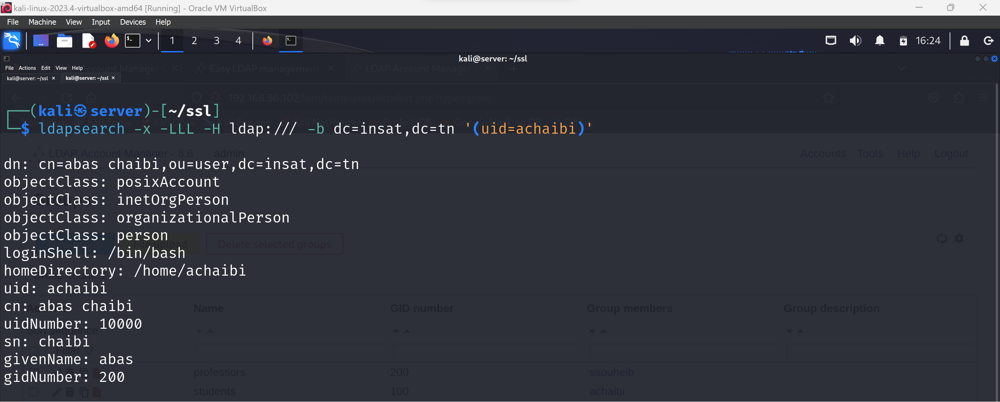
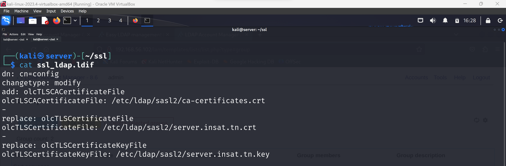
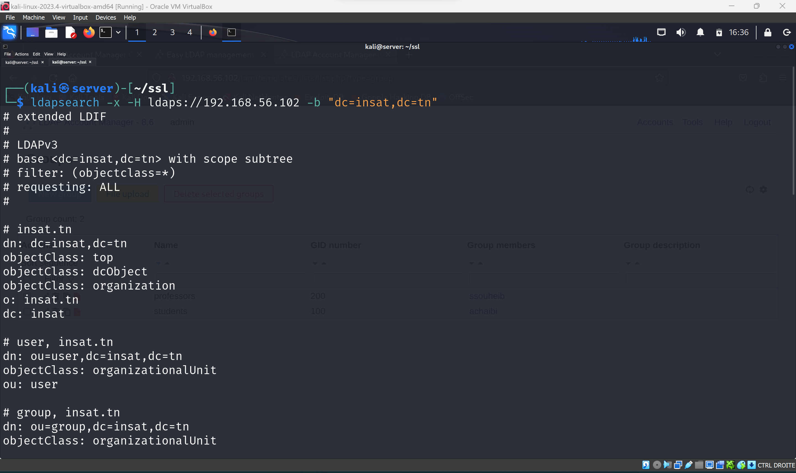
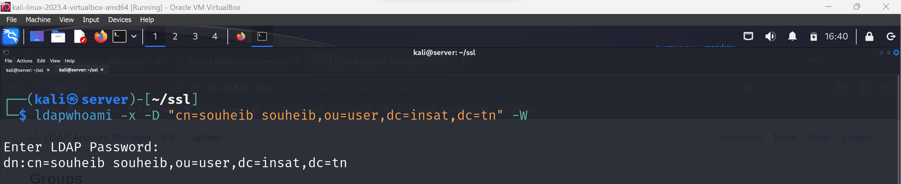
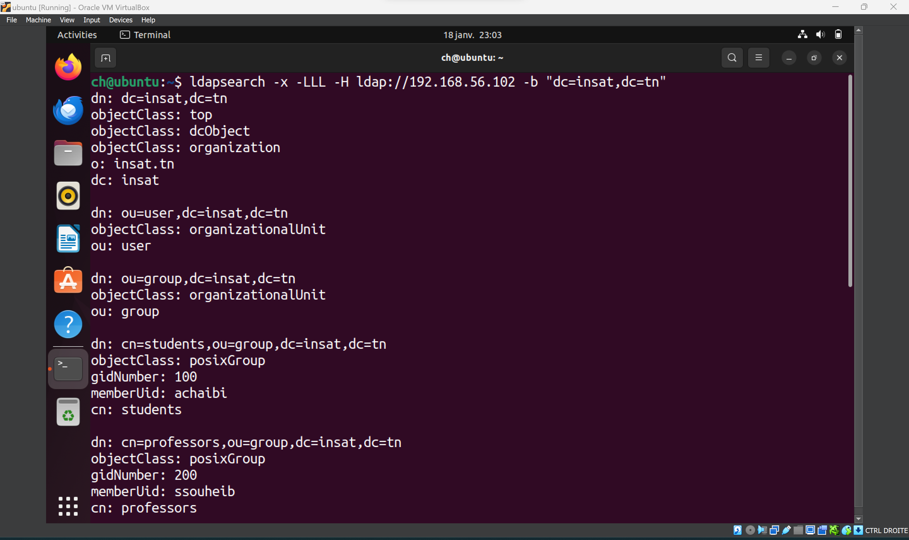
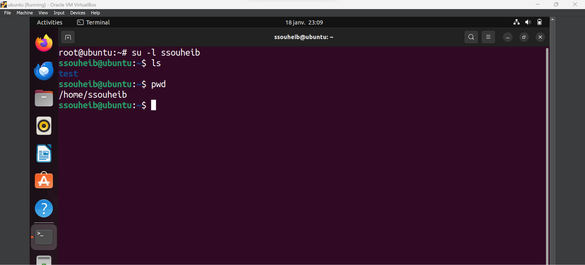

1. **Prerequisites**

   Before proceeding, ensure that you have the following prerequisites:
    - A server with a static IP address.
    - Ubuntu or a compatible Linux distribution installed on your server.
    - Administrative privileges on the server.

2. **Setting up Hostname**

    - Check your server's IP address using the `ifconfig` command.
    - Set the hostname and Fully Qualified Domain Name (FQDN) for your server:

      ```bash
      hostnamectl set-hostname server
      ```

    - Modify the `/etc/hosts` file to add the FQDN entry:

      ```bash
      sudo vim /etc/hosts
      ```

      Add the following line:
      ```
      127.0.1.1 server.insat.tn server
      ```

3. **Installing OpenLDAP**

    - Install the OpenLDAP package:

      ```bash
      sudo apt install slapd ldap-utils -y
      ```

    - Start the OpenLDAP service:

      ```bash
      sudo service slapd start
      ```

4. **Installing Apache and LDAP Account Manager (LAM)**

    - Install Apache web server and PHP modules:

      ```bash
      sudo apt install apache2 php php-cgi libapache2-mod-php php-mbstring php-common php-pear -y
      ```

    - Install LDAP Account Manager (LAM):

      ```bash
      sudo apt install ldap-account-manager -y
      ```

    - Enable the PHP-CGI extension:

      ```bash
      sudo a2enconf php*-cgi
      ```

- We can now access the LDAP Account Manager (LAM) web interface by visiting `http://SERVER_IP/lam` in a web browser.
- Log in with the default credentials: (lam, lam)
- We can add users and groups from the web interface.
- We can managae users and groups from the web interface.


   
   
   
   
   
   


[//]: # (Pour tester LDAP Directory on éxecute la commande suivante :)

[//]: # (ldapsearch -x -LLL -H ldap:/// -b dc=insat,dc=tn '&#40;uid=user1&#41;')

- Pour tester LDAP Directory on éxecute la commande suivante :

  ```bash
  ldapsearch -x -LLL -H ldap:/// -b dc=insat,dc=tn '(uid=user1)'
  ```

  


5. **Adding SSL Certificates**
- On ajoute les certificats


  

- Create an LDIF file named `ssl_ldap.ldif` to add SSL certificates
      

    - Execute the following command to add SSL certificates:

      ```bash
      ldapmodify -x -D cn=admin,dc=insat,dc=tn -W -f ssl_ldap.ldif
      ```

6. **Configuring LDAPS**

- Modify the `/etc/default/slapd` file and configure LDAPS 

[//]: # (  add ldapps:// to the SLAPD_SERVICES variable)

- Modify the `/etc/default/slapd` file and configure LDAPS

  - add `ldaps:///`  to the SLAPD_SERVICES variable


- Modify the `/etc/ldap/ldap.conf` file for LDAPS 
  - change  `TLS_REQCERT ` to `TLS_REQCERT allow` 

- we can now test LDAPS

  ```bash
  ldapsearch -x -H ldaps://192.168.56.102 -b "dc=insat,dc=tn" ```




- Les utilisateurs peuvent s’authentifier avec succés sur le serveur OpenLDAP

```bash 
ldapwhoami -x -D "cn=anas chaibi,ou=users,dc=insat,dc=tn" -W
```



7. **Configuring Client Machine**

    - Modify the `/etc/hosts` file on the client machine to include the server's IP and FQDN:

      ```bash
      sudo vim /etc/hosts
      ```

      Add an entry like this:

      ```
      192.168.152.102 server.insat.tn server
      ```

    - You should now be able to ping the server from the client machine.

8. **Testing LDAP and LDAPS**

    - Install LDAP client packages on the client machine:

      ```bash
      sudo apt install libnss-ldap libpam-ldap ldap-utils nscd -y
      ```

- we set the LDAP server URI to `ldap://192.168.152.10` and the search base to `dc=insat,dc=tn`


    - Configure `/etc/nsswitch.conf` for LDAP .
          
        - Add Or modify  the following lines to the `/etc/nsswitch.conf` file:
    
          ```
          passwd:         files systemd ldap
          group:          files systemd ldap
          shadow:         files ldap
          gshadow:        files
          ```

    - Add the necessary line to `/etc/pam.d/common-session` for LDAP authentication 
    
        - Add the following line to `/etc/pam.d/common-session`:
    
          ```
          session required pam_mkhomedir.so skel=/etc/skel/ umask=077
          ```

- You can now perform LDAP queries and log in from the client machine.


We can login with the user we created in the LDAP server




Pour tester LDAP Directory on éxecute la commande suivante :
`ldapsearch -x -LLL -H ldap:/// -b dc=insat,dc=tn '(uid=user1)'`


   - Maintenant on peut utiliser ldaps

     

      - Les utilisateurs peuvent s’authentifier avec succés sur le serveur OpenLDAP

        

         - we can ping the server too

Now, let's talk about the advantages of LDAPS (LDAP over SSL/TLS):

1. **Communication Encryption:**
   LDAPS uses SSL/TLS to encrypt communications between the client and the LDAP server, ensuring data confidentiality during transit.
2. **Secure Authentication:**
   LDAPS provides secure authentication, meaning that login credentials are transmitted securely, reducing the risk of credential theft.
3. **Data Integrity:**
   The SSL/TLS layer ensures the integrity of data exchanged between the client and the server. This prevents unauthorized tampering with information during transit.
4. **Protection Against Passive Eavesdropping:**
   LDAPS protects against passive eavesdropping, where an attacker could intercept network traffic to retrieve sensitive information.
5. **Compliance with Security Standards:**
   The use of LDAPS aligns with best security practices and industry standards for securing LDAP communications.