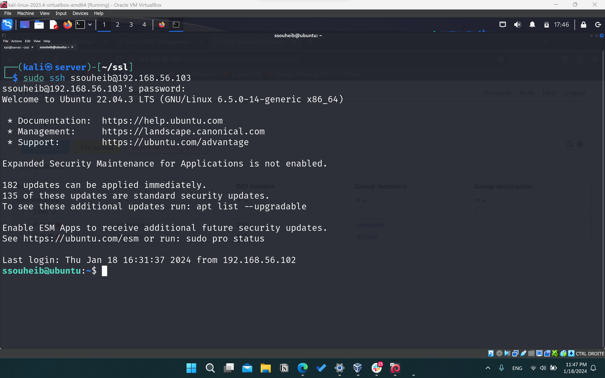
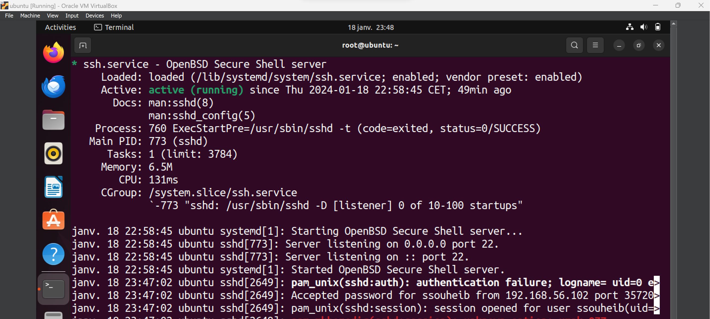

## Section 2: SSH Authentication

To enable SSH authentication via OpenLDAP, you need to configure your SSH server to use OpenLDAP as the authentication source. Here are the steps to achieve this:

### Step 1: Install Necessary Packages

Install the required packages by running the following command:

```bash
sudo apt-get install libpam-ldap
```

### Step 2: Configure `libpam-ldap`

During the installation of `libpam-ldap`, you will be prompted to provide configuration information. Follow the prompts to set up the LDAP authentication.

- Set LDAP SERVER URI to `ldap://192.168.56.102`
- Set LDAP search base to `dc=insat,dc=tn`

### Step 3: Configure `/etc/ssh/sshd_config`

Edit the SSH server configuration file `/etc/ssh/sshd_config` and add the following lines to it:

```text
PasswordAuthentication yes
UsePAM yes
AuthorizedKeysCommand /Desktop/proj/ldap-ssh-keys.sh
AuthorizedKeysCommandUser nobody
```

These lines enable password-based authentication, enable PAM (Pluggable Authentication Module), and specify a command to retrieve SSH public keys from LDAP.


### Step 4: Restart the SSH Service

Restart the SSH service to apply the configuration changes:

```bash
sudo service ssh restart
```


### Step 5: Restrict SSH Access to Users in a Specific OpenLDAP Group

To restrict SSH access to only users who are part of a specific group in OpenLDAP, you need to modify the SSH daemon configuration and utilize PAM (Pluggable Authentication Module) for group-based access control. Here’s how you can do it:

####  Modify `/etc/ssh/sshd_config`

Edit the SSH daemon configuration file `/etc/ssh/sshd_config` to add a directive for allowing only users in a specific group. Add the following line to the file:

```text
AllowGroups ldapgroup
```

Replace `ldapgroup` with the name of the OpenLDAP group that should have SSH access. This setting tells the SSH server to only allow users who are members of the specified group.

#### Configure PAM for Group-Based Access Control

1. **Edit PAM SSH Configuration:**

   Modify the PAM configuration for SSH, typically located at `/etc/pam.d/sshd`. Add the following line to ensure that group membership is checked during authentication:

   ```text
   auth required pam_listfile.so item=group sense=allow file=/etc/ssh/ldapgroups
   ```

   This line tells PAM to check the group membership against a list specified in the file `/etc/ssh/ldapgroups`.

2. **Create and Configure `/etc/ssh/ldapgroups` File:**

   Create a file named `ldapgroups` in the `/etc/ssh` directory. In this file, list the OpenLDAP group(s) that are allowed SSH access. For example:

   ```text
   ldapgroup
   ```

   Ensure that you list each group allowed for SSH access, one per line.

#### Restart the SSH Service

After making these changes, restart the SSH service to apply the new configuration:

```bash
sudo service ssh restart
```

#### Test Group-Based SSH Access

To ensure that the configuration is working as intended, test SSH access with users both within and outside the specified OpenLDAP group. Users who are part of the `ldapgroup` should be able to connect, while others should be denied access.

This approach provides an effective way to control SSH access via OpenLDAP, ensuring that only authorized group members can connect to your SSH servers.


### Step 6: Test SSH Authentication

