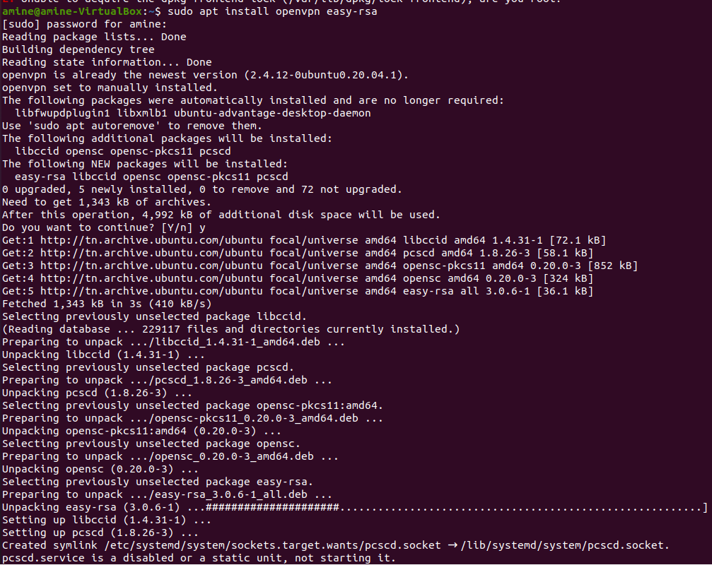

# section 4 :

### ennonce :

Section 4 : Mise en place d'OpenVPN (15 points)
4.1 Installez et configurez OpenVPN pour utiliser l'authentification OpenLDAP.
4.2 Testez la connexion VPN avec succès en utilisant les informations d'OpenLDAP.
4.3 Tester pour un client autorisé et un client non autorisé à lancer un tunnel VPN.

### pratique :

- Explanation
    
    ## Overview:
    
    **Nous allons mettre en œuvre, ici, un serveur OpenVPN utilisant des clefs TLS et authentifiant les utilisateurs avec un annuaire OpenLDAP.**
    
    ## Questions BreakDown :
    
    **4.1 Installez et configurez OpenVPN pour utiliser l'authentification OpenLDAP:**
    
    Dans cette sous-section, l'objectif est d'installer et configurer OpenVPN de manière à intégrer l'authentification OpenLDAP. Cela implique probablement la configuration des paramètres d'OpenVPN, l'intégration avec le serveur OpenLDAP pour la gestion des utilisateurs, et la mise en place des certificats nécessaires à la sécurité de la connexion.
    
    **4.2 Testez la connexion VPN avec succès en utilisant les informations d'OpenLDAP:**
    
    Une fois OpenVPN configuré avec l'authentification OpenLDAP, cette sous-section vise à évaluer la fonctionnalité réussie de la connexion VPN. Les testeurs devront utiliser les informations d'OpenLDAP, telles que les noms d'utilisateur et les mots de passe, pour établir une connexion VPN réussie.
    
    **4.3 Tester pour un client autorisé et un client non autorisé à lancer un tunnel VPN:**
    
    Cette dernière sous-section se concentre sur les tests de sécurité en évaluant la capacité du système à autoriser correctement les clients autorisés et à refuser l'accès aux clients non autorisés. Il peut s'agir de tester la gestion des permissions d'accès aux tunnels VPN en fonction des informations d'authentification provenant d'OpenLDAP.
    
    ## **Tools:**
    
    1. **OpenVPN:** An open-source VPN solution that provides secure point-to-point or site-to-site connections in routed or bridged configurations.
    2. **OpenLDAP:** An open-source implementation of the Lightweight Directory Access Protocol (LDAP) for managing and accessing directory information.
    
    ## Steps:
    
    1. **Step 1: Install OpenVPN**
    2. **Step 2: Generate Certificates**
    3. **Step 3: Configure OpenVPN**
    4. **Step 4: Implement LDAP Authorization**
    5. **Step 5: Test Authorization**
- pratique
    
    ## Step 1 : **Install OpenVPN :**
    
    - `apt install openvpn easy-rsa`
        
        
        
        once we installed the openvpn we go to /etc/openvpn  
        
        
        
    
    - `make-cadir /etc/openvpn/easy-rsa`
        
        used to create a directory structure and necessary files for managing Certificate Authority (CA) with Easy-RSA, a tool that simplifies the generation of SSL certificates
        
        once we created it , we go to /etc/openvpn/easy-rsa
        
        
        
    
    ## **Step 2: Generate Certificates :**
    
    **initialize the Public Key Infrastructure (PKI) for managing SSL certificates :**
    
    `cd /etc/openvpn/easy-rsa`
    
    `./easyrsa init-pki`
    
    
    
    **build the Certificate Authority (CA) for your Public Key Infrastructure (PKI). This command initiates the process of creating the root CA certificate and associated   private key** 
    
    `./easyrsa build-ca`
    
    
    
    **you enter Ca key passPhrase    (in my case : kali )** 
    
    
    
    **once it s done the ca certificat is created** 
    
    
    
    **and the ca key is created   ( in private )** 
    
    
    
    **generate Diffie-Hellman (DH) parameters for key exchange in the context of SSL/TLS encryption : (take some time )** 
    
    `./easyrsa gen-dh`
    
    
    
    **once it s done the dh.pem is created** 
    
    
    
    **Generate a Certificate Request (server) :** 
    
    `./easyrsa gen-req INSAT nopass`
    
    
    
    **once it s done we can see in /etc/openvpn/easy-rsa/pki/reqs** 
    
    
    
    **Sign the Certificate Request (server):**
    
    `./easyrsa sign-req server INSAT`
    
    
    
    **once it s created we can see the INSAT.crt in /etc/openvpn/easy-rsa/pki/issued** 
    
    
    
    **Generate a Certificate Request (client) :** 
    
    **`./easyrsa gen-req amine nopass`**
    
    
    
    **Sign the Certificate Request (client):**
    
    `./easyrsa sign-req client amine`
    
    
    
    ## **Step 3: Configure OpenVPN (server):**
    
    **copy a sample OpenVPN server configuration file to the appropriate directory**
    
    `sudo cp /usr/share/doc/openvpn/examples/sample-config-files/server.conf.gz /etc/openvpn/server/`
    
    **decompress a gzip-compressed file**
    
    **`sudo gunzip /etc/openvpn/server/server.conf.gz`**
    
    **you can see the server.conf in /etc/openvpn/server/**
    
    `sudo nano  /etc/openvpn/server/server.conf`
    
    
    
    **generate a shared secret key file (`ta.key`) for OpenVPN in (/etc/openvpn/ )**
    
    `openvpn --genkey --secret ta.key`
    
    once it s done we can see :
    
    
    
    **configure the server.conf : we put the location of the server req and cert and ca and ta :**
    
    
    
    
    
    **enable the OpenVPN service with a specific configuration file (`server.conf` )**
    
    `sudo systemctl -f enable openvpn-server@server.service`
    
    **start the OpenVPN service :**
    
    **`sudo systemctl start openvpn-server@server.service`**
    
    **Start the server : ( you need to be in /etc/openvpn/server/ )**
    
    **`openvpn --config server.conf`**
    
    
    
    **in case of error (address already in use ) run this command and then start the server again** 
    
    `sudo pkill openvpn`
    
    ## Step 3: Configure OpenVPN (client)
    
    **copy a sample OpenVPN client configuration file to the appropriate directory**
    
    `cp /usr/share/doc/openvpn/examples/sample-config-files/client.conf /etc/openvpn/client/`
    
    **you can see client.conf in /etc/openvpn/client/**
    
    `sudo nano /etc/openvpn/client/client.conf`
    
    
    
    **configure the client.conf : we put the location of the server req and cert and ca and ta :**
    
    
    
    
    
    **start the client.conf** 
    
    
    
    ## **Step 4: Implement LDAP Authorization :**
    
    **create a new directory named "auth" within the "/etc/openvpn" directory**
    
    `mkdir /etc/openvpn/auth`
    
    
    
    **create file ldap-auth.conf and configuration** 
    
    `sudo nano /etc/openvpn/auth/ldap-auth.conf`
    
    <LDAP>
    # LDAP server URL
    URL     ldap://www.insatGl4.tn
    
    ```
        # Bind DN (If your LDAP server doesn't support anonymous binds)
        BindDN          cn=admin,dc=www,dc=insat,dc=tn
    
        # Bind Password
        Password        kali
    
        # Network timeout (in seconds)
        Timeout         15
    
        # Enable Start TLS
        TLSEnable       no
    
        # Follow LDAP Referrals (anonymously)
        # FollowReferrals yes
    
        # TLS CA Certificate File
    
        # TLS CA Certificate Directory
        # TLSCACertDir  /etc/ssl/certs
    
        # Client Certificate and key
        # If TLS client authentication is required
    
    ```
    
    </LDAP>
    <Authorization>
    # Base DN
    BaseDN		ou=users,dc=www,dc=insat,dc=tn
    
    ```
    # User Search Filter
    SearchFilter	"(&(uid=%u)(objectClass=posixAccount))"
    
    # Require Group Membership
    RequireGroup	true
    
    # Add non-group members to a PF table (disabled)
    #PFTable	ips_vpn_users
    
    # Uncomment and set to true to support OpenVPN Challenge/Response
    #PasswordIsCR	false
    <Group>
    	# Default is true. Match full user DN if true, uid only if false.
    	RFC2307bis   false
    
    	# Default is true. Uncomment and set to false if you want to use a Search operation to determine group
    	# membership instead of Compare. Lower performance, so Compare should generally be used, but Search is
    	# required in certain LDAP environments.
    	# UseCompareOperation   true
    
    	BaseDN		ou=groups,dc=www,dc=insat,dc=tn
    	SearchFilter	"(|(cn=ad))"
    	MemberAttribute	memberUid
    	# Add group members to a PF table (disabled)
    	#PFTable	ips_vpn_eng
    </Group>
    
    ```
    
    </Authorization>
    
    **ajouter plugin dans server.conf :**
    
    `cd nano /etc/openvpn/server/server.conf`
    
    plugin /usr/lib/openvpn/openvpn-auth-ldap.so /etc/openvpn/auth/auth-ldap.conf
    verify client-cert optional
    
    **ajouter dans client.conf**
    
    auth-user-pass
    
    ## **Step 5: Test Authorization**
    
    **restart the service :**
    
    `systemctl restart openvpn-server@server`
    
    **start the server :**
    
    `openvn --config server.conf`
    
    
    
    start the client :
    
    `openvpn —config client.conf`
    
    
