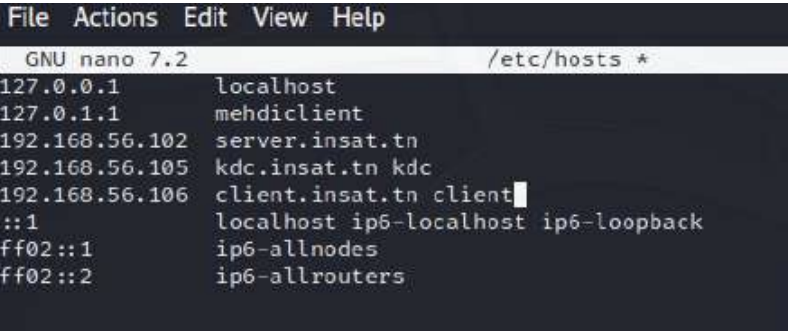

# Kerberos Server Configuration 

## Introduction
This guide outlines the steps for configuring a Kerberos server and a client machine. Kerberos is a network authentication protocol that uses tickets to allow nodes to prove their identity in a secure manner.

## Prerequisites
- Two machines (one for the server, one for the client)
- Operating System: Ubuntu or similar Linux distribution
- Sudo privileges on both machines

## Configuration Steps

### Step 1: Setting Hostnames and FQDN
- Set the hostname on the server and client machines:
   - Server: `sudo hostname set-hostname kdc.insat.tn`
   - Client: `sudo hostname set-hostname client.insat.tn`
- Modify the `/etc/hosts` file on both machines to ensure proper name resolution.
   - 
   - 

### Step 2: Installing Kerberos Packages
- Install Kerberos packages on the server and client machines:
  ```bash
  sudo apt install krb5-kdc krb5-admin-server krb5-config
  ```
   - 
     ... [Other installation images]

### Step 3: Configuring Kerberos
1. **View and Edit Kerberos Configuration Files**
   - View the contents of `/etc/krb5.conf`.
     
   - Create a new Realm.
     
   - Modify `/etc/krb5kdc/kadm5.acl`.
     
     ... [Continue with other relevant images]

2. **Creating Principals**
   - Use `kadmin.local` to create various principals including `root/admin` and host principals.
     
     ... [Continue with other relevant images]

### Step 4: Managing Keytabs
- Add entries in the keytab file and verify them.
  
  ... [Continue with other keytab images]

### Step 5: Configuring OpenSSH with Kerberos
1. **Install OpenSSH Server:**
   ```bash
   sudo apt install openssh-server
   ```
   Configure `/etc/ssh/sshd_config` and `/etc/ssh/ssh_config` for Kerberos authentication.
   
   ... [Continue with other SSH configuration images]

2. **Install krb5-user Package:**
   ```bash
   sudo apt install krb5-user
   ```


 

